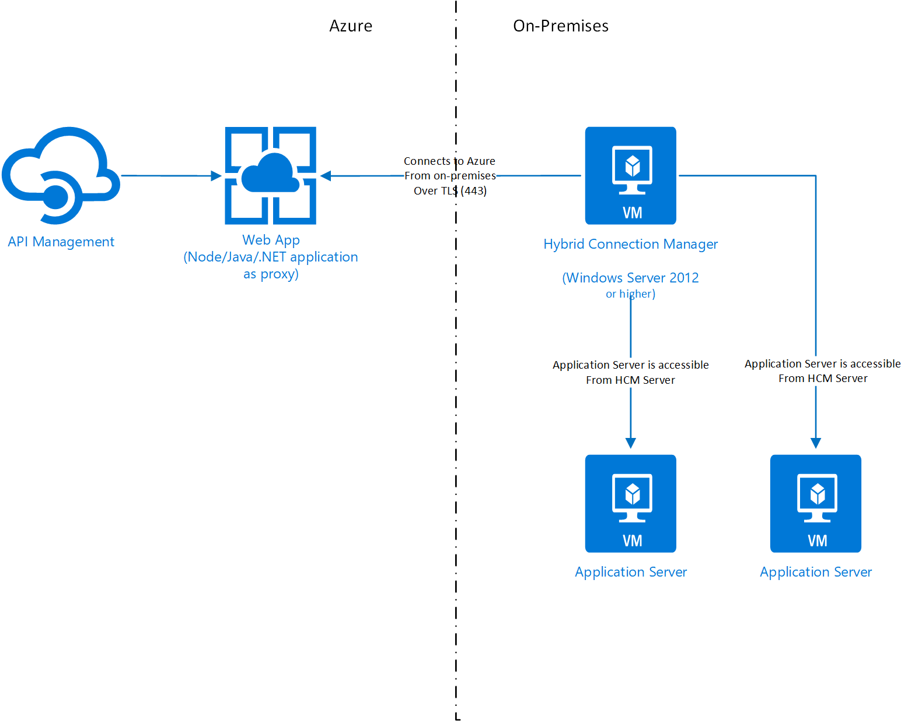

# Connect your on-premises applications to Azure API Management using Hybrid Connections

The goal of this demo is to utilize App Service Hybrid Connecions as a communication channel to connect on-premises services to Azure without opening any inbound ports.  Hybrid Connections allows us to make a one-way connection from on-premises to Azure via Service Bus Relays.

In order to use Hybrid Connections, a Windows Server 2012 or higher machine needs to be installed (an existing server will also work).  Once the server is ready, continue to installing the Hybrid Connection Manager (HCM).  This is the application that creates the outbound connection to Azure and facilitates the TCP connection to the applications that are behind the on-prem firewalls.  Ensure that the server is able to connect to the application servers.  You can have one or more HCM servers.

### Topology




### Components to Deploy

#### Azure Virtual Network

You'll need an Virtual Network if you are electing to deploy an App Service Environment (ASE) and API Management that needs to integrate with ASE using private IP addresses.

#### App Service Environment or App Service

App Service Environment (ASE) will provide the ability to secure the access points since it is deployed within your virtual network on Azure.  Since ASEs are slightly more expensive, you can prototype with App Service as well.  Just make to setup App Service with at least the Standard SKU.

If you are deploying an ASE, you can choose the VIP to be internal.  Follow the [instructions](https://docs.microsoft.com/en-us/azure/app-service/environment/create-ilb-ase) to complete the deployment.

`This deployment will take about 60 minutes.`

#### API Management

API Management is used to abstract the underlying integration points with the application servers.  It provides features such as request throttling, subscription based access, monitoring, transformations, etc.

Follow the [instructions](https://docs.microsoft.com/en-us/azure/api-management/get-started-create-service-instance) to complete the deployment.  You can choose the `Developer` SKU since it will be enough to get the solution deployed.

`This deployment will take about 45 minutes.`

#### Custom Proxy Application

Hybrid Connections use DNS resolution as the means to intercept and route the traffic to the correct destination.  Therefore, you'll need to write or reuse a simple HTTP proxying application.  In this project, you'll find 2 examples (nodejs and ASP.NET Core).  You can use either to deploy on ASE.

ASP.NET Core application is general purpose enough to compile and deploy directly.  You'll need to edit [proxy-config.json](dotnetcore-proxy/WebProxy/proxy-config.json) to map the URL contexts to your backend servers, you can have multiple paths.  You can put Regex in the `path` field to match multiple patterns.

```json
{
    "proxies": [
      {
        "path": "/orders/",
        "proxyProtocol": "http",
        "proxyHost": "appserver",
        "proxyPort": 9000
      },
      {
        "path": "/customers/",
        "proxyProtocol": "http",
        "proxyHost": "appserver2",
        "proxyPort": 9000
      }
    ]
}
```
