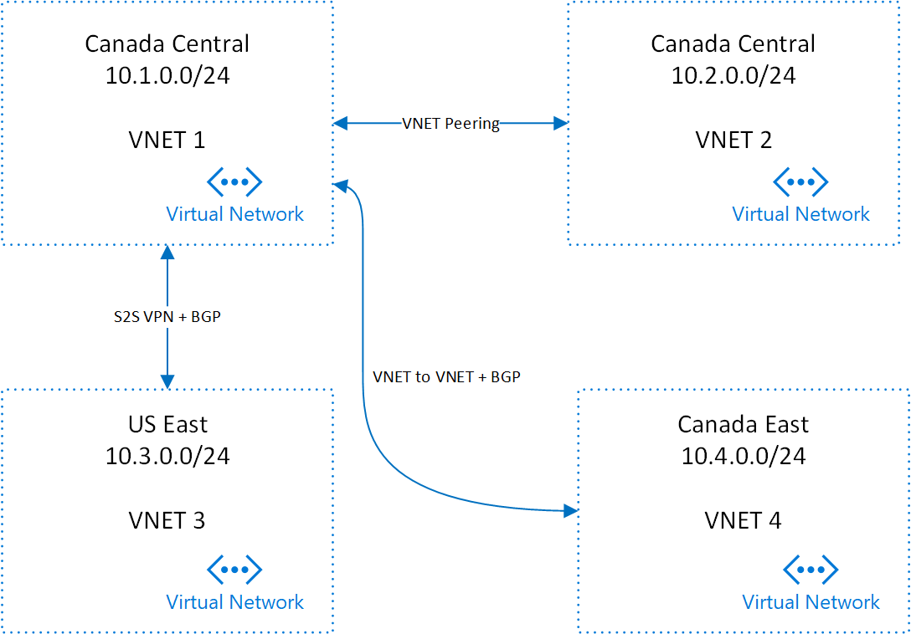

# Multi-region Topology

## Overview
Describe the topology that enables customers to connect multiple virtual networks together across disparate regions using S2S VPN, Peering and VNET to VNET integration.

## Diagram

## Connectivity Scenarios

|    | VNET 1 | VNET 2 | VNET 3 | VNET 4 |
| ---:|:-----:|:------:|:------:|:------:|
| **VNET 1** | -|VNET Peering|S2S VPN + BGP| VNET to VNET + BGP|
| **VNET 2** |VNET Peering|- |via `VNET 1`|via `VNET 1`|
| **VNET 3** |S2S VPN + BGP|via `VNET 1`|-|via `VNET 1`|
| **VNET 4** |VNET to VNET + BGP|via `VNET 1`|via `VNET 1`|-|

## Automation Template

Coming Soon
