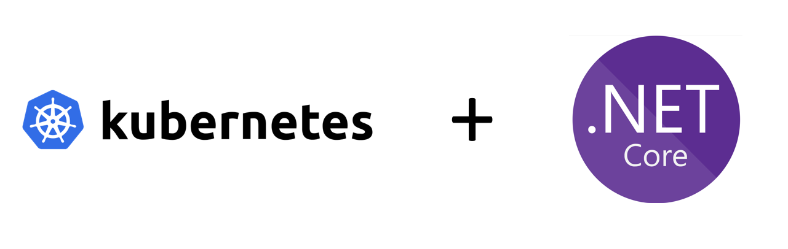

# Deploy ASP.NET Core 2.0 on Kubernetes



## Create Application & Test Application

### New Application
```bash
dotnet new webapi
```

### Compile & Publish
```bash
dotnet publish
```

### Build Docker Image

```Dockerfile
FROM microsoft/aspnetcore

WORKDIR /app
COPY ./app/bin/Debug/netcoreapp2.0/publish .

ENV ASPNETCORE_URLS http://+:80
EXPOSE 80

ENTRYPOINT ["dotnet", "code.dll"]
```

```bash
docker build -t dotnetwebapi .
```

### Locally Run Application
```bash
docker run -P dotnetwebapi
docker ps

# Get port number that's mapped to 80
curl http://localhost:32770/api/values

# Expected Value
# ["value1","value2"]
```

### Create ACS with Kubernetes 1.7.9, ACR & Push Image

```bash
# Create Resource Group
az group create -n dotnetcore -l canadacentral

# Create Azure Container Registry
az acr create -n dotnetcoreacr -l canadacentral -g dotnetcore --sku Standard --admin-enabled

# Create ACS Cluster
az acs create -n ss -g dotnetcore --orchestrator-type Kubernetes --orchestrator-version 1.7.9

# Get ACR Credentials
az acr credential show -n dotnetcoreacr -g dotnetcore

# Login to Docker
docker login dotnetcoreacr.azurecr.io -u dotnetcoreacr

# Tag Docker Image
docker tag dotnetwebapi dotnetcoreacr.azurecr.io/dotnetwebapi

# Push to ACR
docker push dotnetcoreacr.azurecr.io/dotnetwebapi
```

### Create YAML file: kubernetes.yaml

This definition will create 1 POD with 5 replicas.  The replicas will be load balanced via Service using an Azure Load Balancer & Public IP. 

```yaml
---
apiVersion: v1
kind: Service
metadata:
  name: webapi-lb
spec:
  selector:
    app: webapi_backend
  ports:
  - port: 80
    targetPort: 80
  type: LoadBalancer
---
apiVersion: extensions/v1beta1
kind: Deployment
metadata:
  name: webapi-deployment
spec:
  replicas: 5
  revisionHistoryLimit: 2
  minReadySeconds: 10
  strategy:
    type: RollingUpdate
    rollingUpdate:
      maxSurge: 1
      maxUnavailable: 1
  template:
    metadata:
      labels:
        app: webapi_backend
    spec:
      containers:
      - name: webapi-container
        image: dotnetcoreacr.azurecr.io/dotnetwebapi:latest
        imagePullPolicy: Always
        ports:
        - containerPort: 80
      imagePullSecrets:
        - name: acr
```

### Connect to Kubernetes & Deploy Image

```bash
# Download Kubernetes credentials
az acs kubernetes get-credentials -n ss -g dotnetcore

# Validate connectivity
kubectl get nodes

# Create secret to allow Kubernetes to download images from ACR
kubectl create secret docker-registry acr --docker-server=dotnetcoreacr.azurecr.io --docker-username=dotnetcoreacr --docker-password=<ENTER_PASSWORD> --docker-email=Senthuran.Sivananthan@microsoft.com 

# Deploy YAML
kubectl apply -f kubernetes.yaml

# Monitor the deployment and wait for public IP to be provided for the service
watch -n 1 kubectl get all
```

### Test
```bash

# Replace 52.228.47.228 with your own IP that was assigned to the service
curl http://52.228.47.228/api/values
```